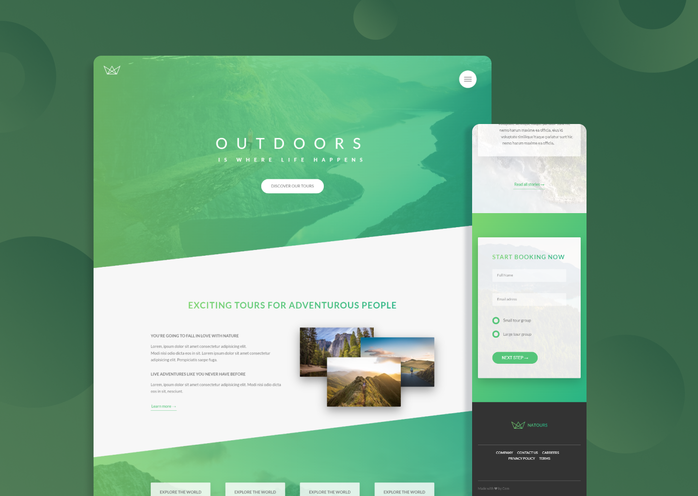

  

    <h1>Natours</h1>
     
    
A responsive website for booking explorations tours in the heart of nature

    <h3><a href="https://natours-cem.netlify.app/">🔗 Link to the Website</a></h2>
    
  

## Built With

## Features

- Advanced CSS Properties
- Original Animations and Transitions
- Form with Checkbox Hack
- Card Flip Component

## Context of the project

This is a part of a Front-End Dev Course that i've completed on Udemy
